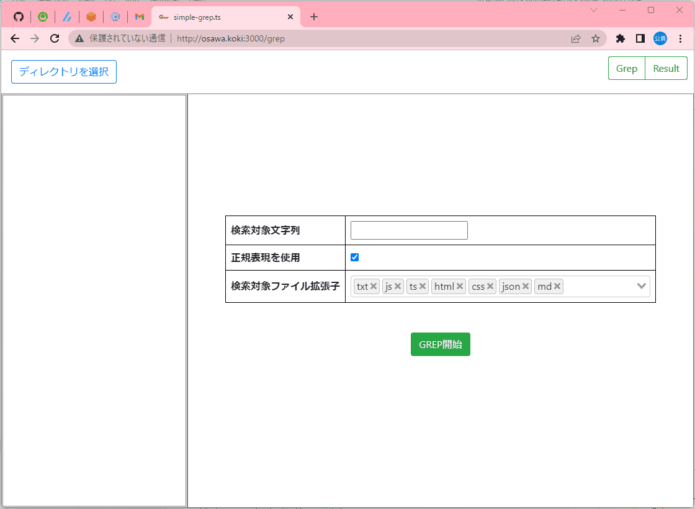

# simple-grep.ts

ディレクトリ内の文字列検索を行う簡単なツール。  

  

## 実行方法

```shell
# デバグ
yarn dev

# デプロイ用ビルド
yarn generate
```

## 環境情報

| module | version |
| ---- | ---- |
| Windows | 11 Home |
| Node | v16.18.0 |
